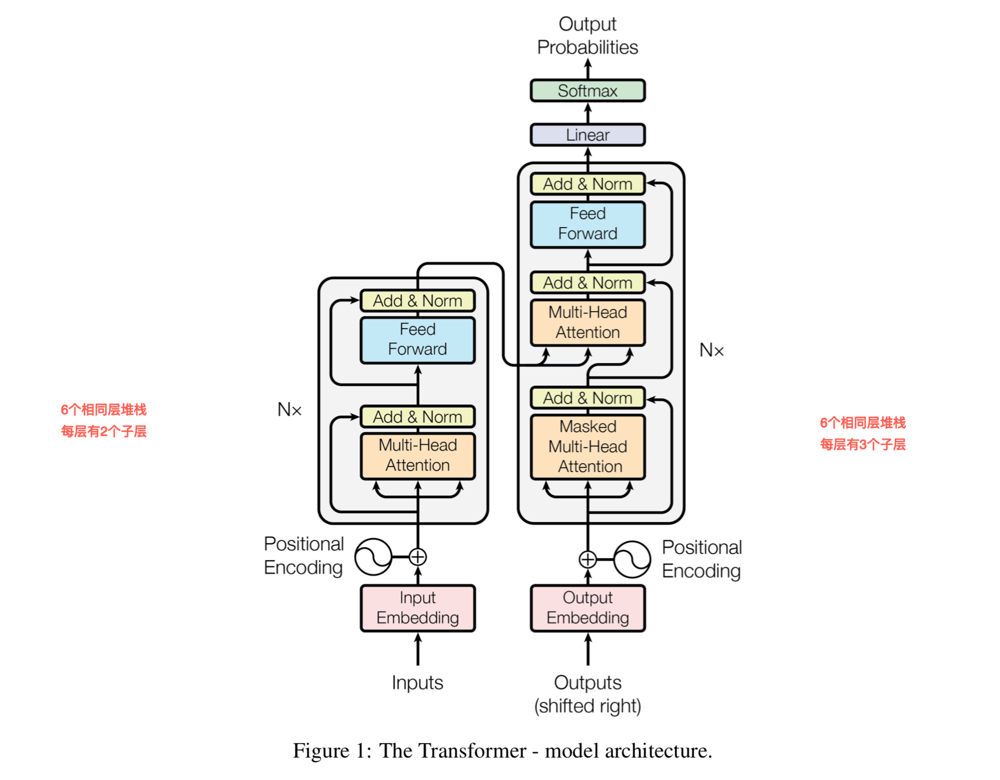

# 自定义模型和层

> 参考自[Transformer model for language understanding](https://tensorflow.google.cn/tutorials/text/transformer?hl=en)

### 1、seq2seq 里的注意力机制

### 2、transformer 里的自注意力机制

> 首先，Transformer模型也是使用经典的encoder-decoder架构，由encoder和decoder两部分组成。\
上图左侧用Nx框出来的，是encoder的一层。encoder一共有6层这样的结构。\
上图右侧用Nx框出来的，是decoder的一层。decoder一共有6层这样的结构。\
输入序列经过word embedding和positional embedding相加后，输入到encoder中。\
输出序列经过word embedding和positional embedding相加后，输入到decoder中。\
最后，decoder输出的结果，经过一个线性层，然后计算softmax。